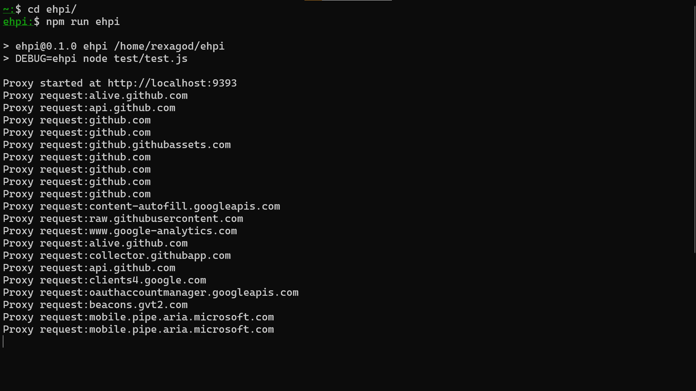
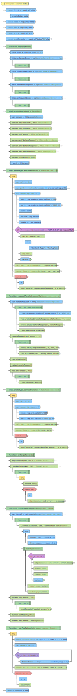

# ehpi - Enhanced Proxy Protocol Implementation

**`ehpi` supports both forward and reverse proxying types.**

### Forward Proxy Flow

### Reverse Proxy Flow

**HTML-rendered documentation can be found [here](https://rexagod.github.io/ehpi/).**

## API

<!-- Generated by documentation.js. Update this documentation by updating the source code. -->

#### Table of Contents

-   [index](#index)
-   [zlib](#zlib)
-   [http](#http)
-   [net](#net)
-   [url](#url)
-   [Cache](#cache)
-   [ehpiConsole](#ehpiconsole)
-   [ehpi](#ehpi)
    -   [Parameters](#parameters)
    -   [port](#port)
    -   [port](#port-1)
    -   [onServerError](#onservererror)
    -   [onBeforeRequest](#onbeforerequest)
    -   [onBeforeResponse](#onbeforeresponse)
    -   [onRequestError](#onrequesterror)
    -   [start](#start)
    -   [requestHandler](#requesthandler)
        -   [Parameters](#parameters-1)
    -   [connectHandler](#connecthandler)
        -   [Parameters](#parameters-2)
-   [requestRemote](#requestremote)
    -   [Parameters](#parameters-3)
-   [ontargeterror](#ontargeterror)
    -   [Parameters](#parameters-4)
-   [connectRemote](#connectremote)
    -   [Parameters](#parameters-5)
-   [\_synReply](#_synreply)
    -   [Parameters](#parameters-6)

### index

ehpi - Enhanced HTTP Proxy Implementation module.

### zlib

Used for Gzip stream compression of the response.

### http

Used to access internal HTTP APIs.

### net

Used to access internal Socket APIs.

### url

Used to parse host information.

### Cache

Used for caching response stream from the target.

### ehpiConsole

Enable debug logging by passing `DEBUG=ehpi`.

### ehpi

Constructs an ehpi instance.

#### Parameters

-   `options` **[Object](https://developer.mozilla.org/docs/Web/JavaScript/Reference/Global_Objects/Object)** The configuration options for the proxy server.

#### port

Server's port number.

#### onServerError

Server's internal error event handler.

#### onBeforeRequest

Server's before request event handler.

#### onBeforeResponse

Server's before response event handler.

#### onRequestError

Server's request error event handler.

#### start

Starts the Proxy Server.

#### requestHandler

Server's global request handler.

##### Parameters

-   `req` **[Object](https://developer.mozilla.org/docs/Web/JavaScript/Reference/Global_Objects/Object)** The request stream object literal.
-   `res` **[Object](https://developer.mozilla.org/docs/Web/JavaScript/Reference/Global_Objects/Object)** The response stream object literal.

#### connectHandler

Handles SYN operation back to socket after connection is established, else throws.

##### Parameters

-   `req` **[Object](https://developer.mozilla.org/docs/Web/JavaScript/Reference/Global_Objects/Object)** The request stream object literal.
-   `socket` **[Object](https://developer.mozilla.org/docs/Web/JavaScript/Reference/Global_Objects/Object)** The socket used for SYN operation.

### requestRemote

Initiates request from the Proxy server for the requested resource.

#### Parameters

-   `requestOptions` **[Object](https://developer.mozilla.org/docs/Web/JavaScript/Reference/Global_Objects/Object)** The host, port, path, method, and header values.
-   `req` **[Object](https://developer.mozilla.org/docs/Web/JavaScript/Reference/Global_Objects/Object)** The request stream object literal.
-   `res` **[Object](https://developer.mozilla.org/docs/Web/JavaScript/Reference/Global_Objects/Object)** The response stream object literal.
-   `proxy` **[Object](https://developer.mozilla.org/docs/Web/JavaScript/Reference/Global_Objects/Object)** The instantiated ehpi instance.

### ontargeterror

Acknowledges Tunnel errors and attempts to gracefully close the socket, else throw.

#### Parameters

-   `e` **[Object](https://developer.mozilla.org/docs/Web/JavaScript/Reference/Global_Objects/Object)** The error object literal.

### connectRemote

Attempts to connect to target URI and establish a tunnel.

#### Parameters

-   `requestOptions` **[Object](https://developer.mozilla.org/docs/Web/JavaScript/Reference/Global_Objects/Object)** The host, port, path, method, and header values.
-   `socket` **[Object](https://developer.mozilla.org/docs/Web/JavaScript/Reference/Global_Objects/Object)** The socket used for SYN operation.

### \_synReply

Utility function that writes input to socket.

#### Parameters

-   `socket` **[Object](https://developer.mozilla.org/docs/Web/JavaScript/Reference/Global_Objects/Object)** The socket used for SYN operation.
-   `code` **[number](https://developer.mozilla.org/docs/Web/JavaScript/Reference/Global_Objects/Number)** The HTTP status code.
-   `reason` **[string](https://developer.mozilla.org/docs/Web/JavaScript/Reference/Global_Objects/String)** The event that resulted in this SYN operation.
-   `headers` **[Object](https://developer.mozilla.org/docs/Web/JavaScript/Reference/Global_Objects/Object)** The HTTP headers.
-   `cb` **[Object](https://developer.mozilla.org/docs/Web/JavaScript/Reference/Global_Objects/Object)** The error handler callback.

## Flowchart

